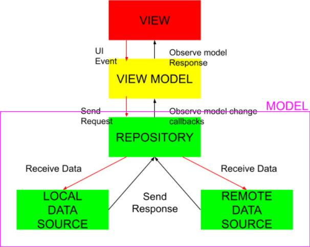

# Shopping List

An Android app for saving a shopping list, built with MVVM pattern
as well as Architecture Components.

Build System : [Gradle](https://gradle.org/)

## Table of Contents

- [Prerequisite](#prerequisite)
- [App](#app)
- [Architecture](#architecture)
- [Testing](#testing)
- [Libraries](#libraries)
- [Screenshots](#screenshots)

## Prerequisite

This project uses the Gradle build system. To build this project, use the
`gradlew build` command or use "Import Project" in Android Studio.

## App

The app takes input from a user and displays them in a list. It also
has Room DB for local cache. When the plus or minus sign is clicked the shopping item
amount changes.

## Architecture

The app is built using the Modular MVVM architectural pattern and makes heavy use of a couple of
Android Jetpack components. MVVM allows for the separation of concern which also makes testing
easier. The app has a fragment that communicates to ViewModel which in turn communicates to the
usecase which communiacates to Repository to get data.

||
|:----:|

## Testing

With MVVM testing is made easier in that Ui can be tested separately from the business logic.
Mocking the ViewModel to test the fragment for user interaction using espresso, mocking the
repository to test the ViewModel with Junit as well as mocking the API service/dao to test the
repository using the Junit.

## Libraries

Libraries used in the whole application are:

- [Jetpack](https://developer.android.com/jetpack)🚀
    - [Viewmodel](https://developer.android.com/topic/libraries/architecture/viewmodel) - Manage UI
      related data in a lifecycle conscious way
    - [Data Binding](https://developer.android.com/topic/libraries/data-binding) - support library
      that allows binding of UI components in layouts to data sources, binds search results to UI
    - [Room](https://developer.android.com/training/data-storage/room) - Provides abstraction layer
      over SQLite used for cache
- [kotlinx.coroutines](https://github.com/Kotlin/kotlinx.coroutines) - Library Support for
  coroutines
- [Kodein](https://github.com/kosi-libs/Kodein) - Used for
  Dependency injection
- [Material Design](https://m3.material.io/) - Used for the User Interface
  

https://developer.android.com/training/data-storage/room
## Screenshots

|||
